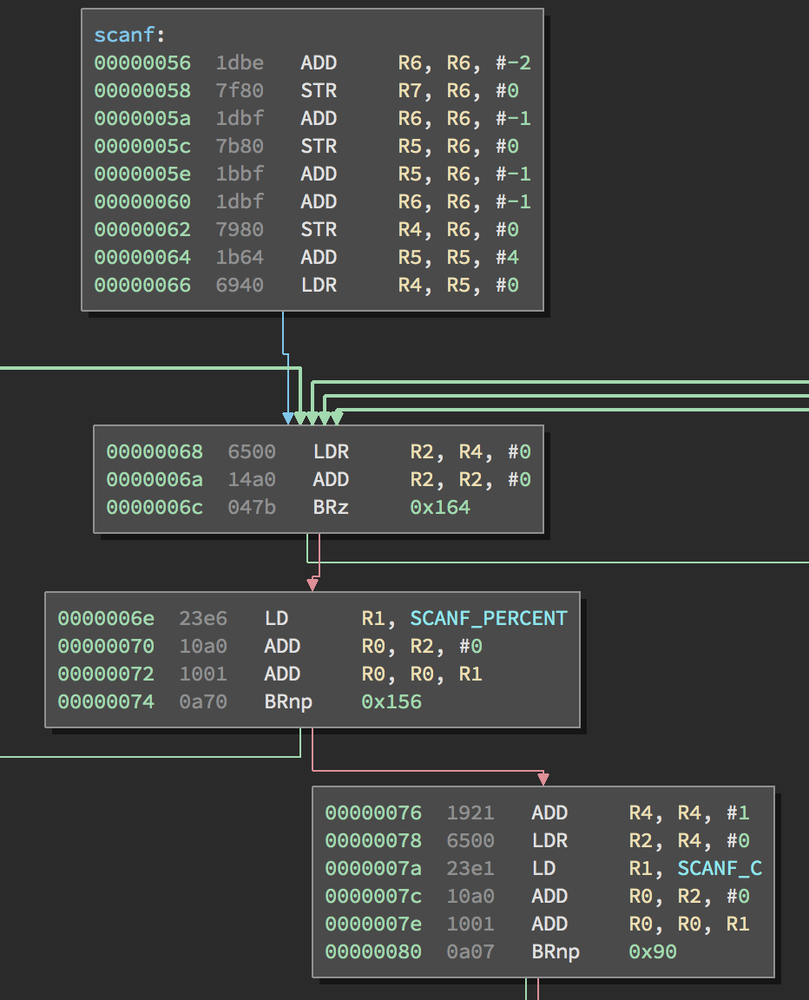

# LC-3 Architecture Plugin (v0.1)
Author: **Paw Petersen**

_Disassembler for the LC-3 architecture._

## Description:

Plugin for disassembling code for the Little Computer 3 architecture:

Linux installation: `cd ~/.binaryninja/plugins && git clone https://github.com/kapaw/binaryninja-lc3.git lc3`.

Tested using code generated by `http://highered.mcgraw-hill.com/sites/0072467509/student_view0/c_to_lc-3_compiler.html`.

## Minimum Version

This plugin requires the following minimum version of Binary Ninja:

 * release - 1.0.320
 * dev - 1.0.320-dev

## License

This plugin is released under a [MIT](LICENSE) license.

